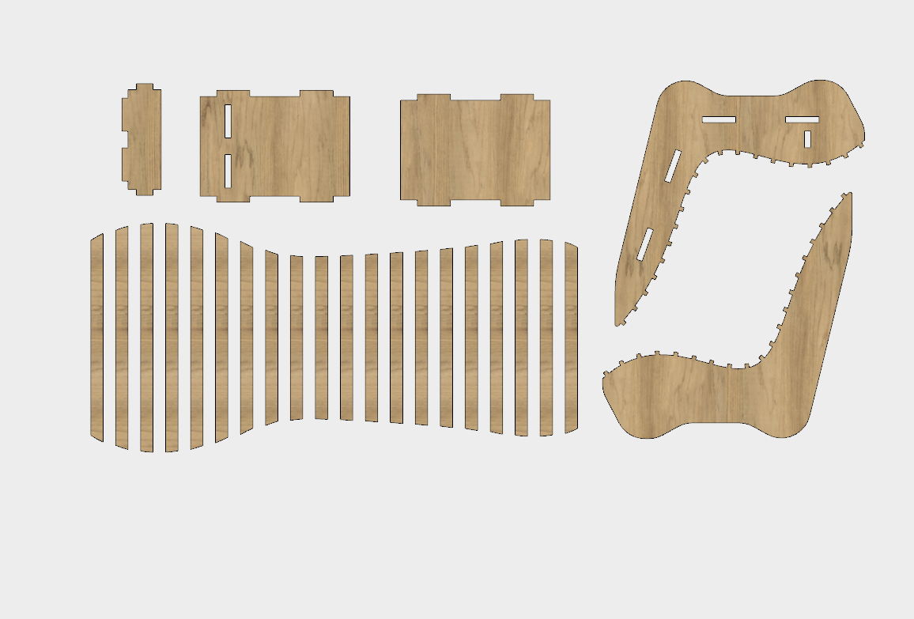

# NESTER
Simple script to lay parts out flat in Fusion 360.  This is not an "official" app, rather something I have been working on as a hobby.
It is specifically useful for use with a CNC Router.  
I use it to take all of the parts in a design and ley them out flat.

## Usage:
First see [How to install sample Add-Ins and Scripts](https://rawgit.com/AutodeskFusion360/AutodeskFusion360.github.io/master/Installation.html)

See a youtube video of using the script here: https://www.youtube.com/watch?v=7SY367qt3YQ

## License
Samples are licensed under the terms of the [MIT License](http://opensource.org/licenses/MIT). Please see the [LICENSE](LICENSE) file for full details.

## Written by

Written by Patrick Rainsberry   (Autodesk Fusion 360 Business Development)
